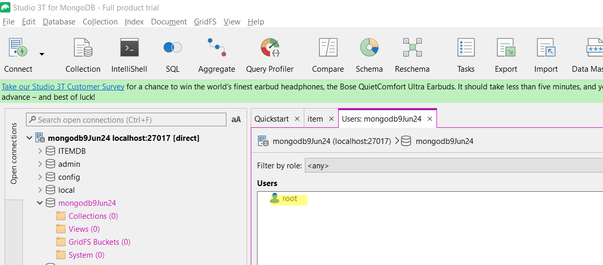
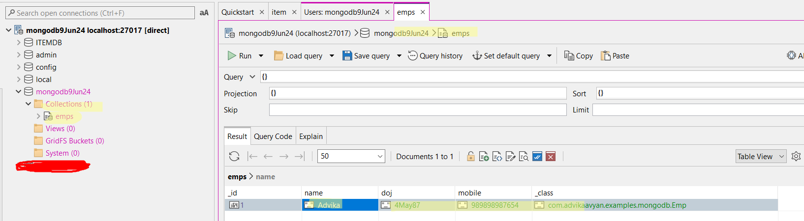

# springbootmongodb
1. Install mongo db server from https://www.mongodb.com/try/download/community
   1. mongodb-windows-x86_64-7.0.11-signed
2. download editor Studio 3T paid software 30 days for free: https://studio3t.com/download-thank-you/?OS=win64
3. or mongo db compas
Studio 3T.. created a user 
4. new record added 